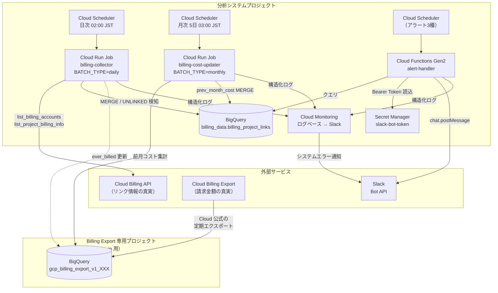
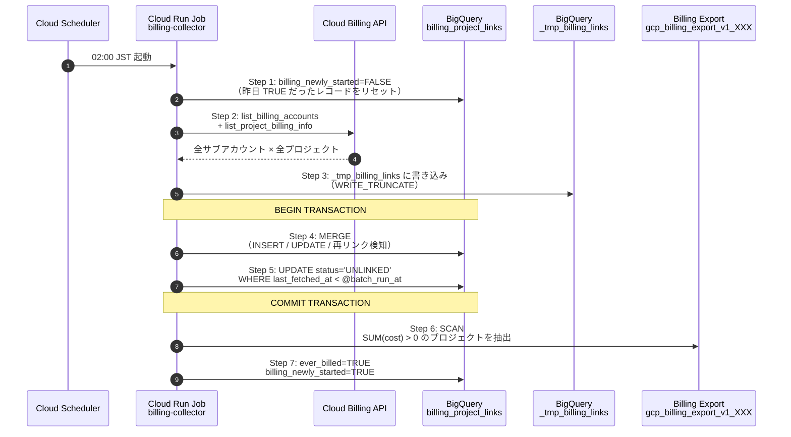
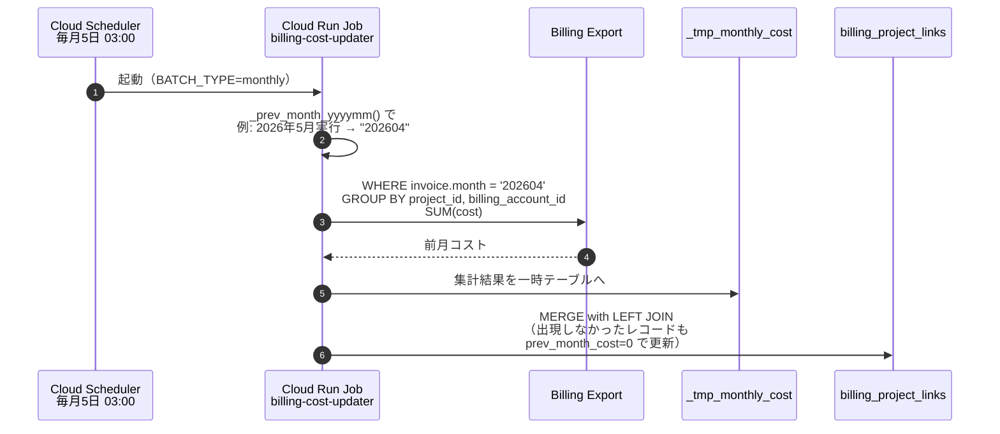
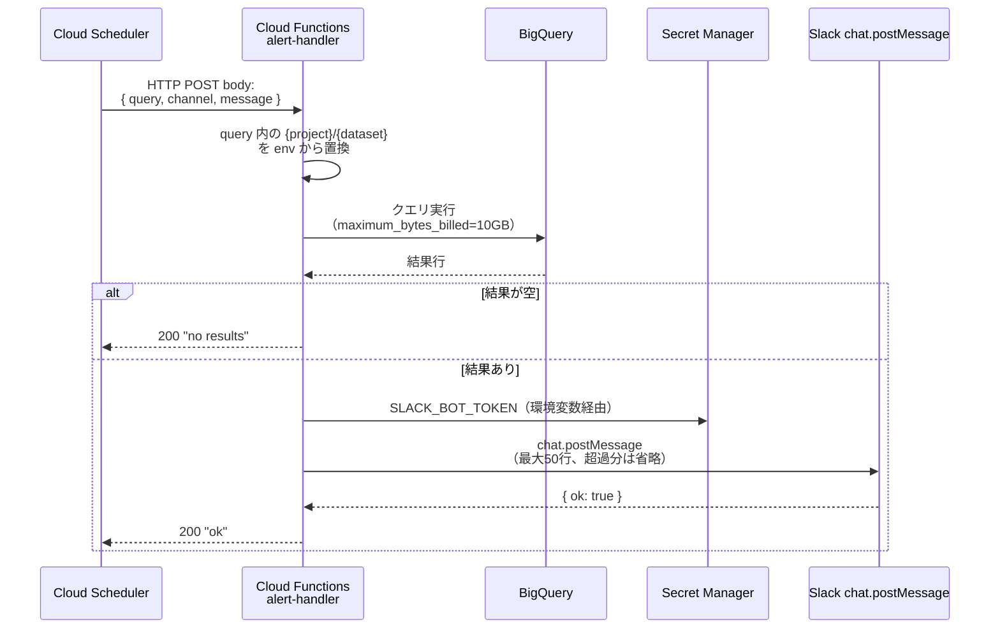
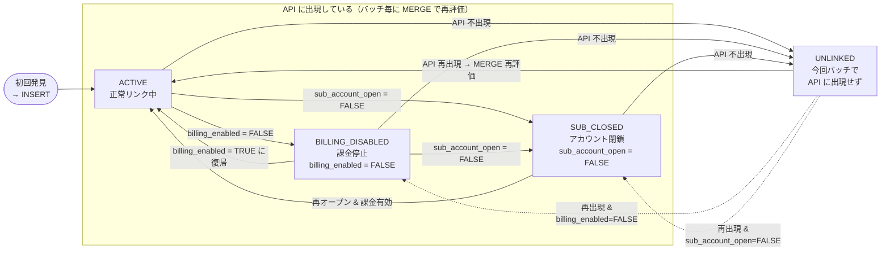
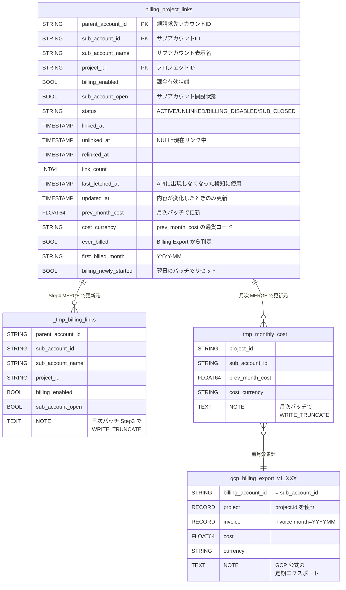
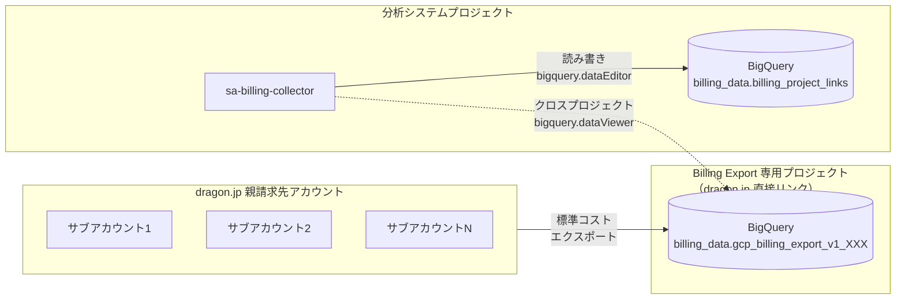
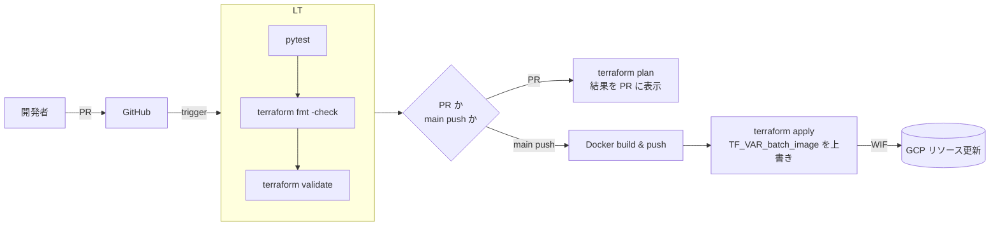

# アーキテクチャ

このシステム全体を **図で理解する** ためのページ。テキスト詳細は [requirements.md](./requirements.md) と [alert_design.md](./alert_design.md) を参照。

______________________________________________________________________

## 1. システム全体構成



**読み方のポイント**

- **データの真実** は GCP の Billing API（リンク情報）と Billing Export（請求金額）の 2 つに分かれている。Billing API は課金金額を返せないため、コスト集計には Billing Export の BigQuery 出力が必須（詳細は [decisions.md §12](./decisions.md)）
- 日次バッチ `billing-collector` がこの 2 つを統合して `billing_project_links` テーブルを最新化する
- 月次バッチ `billing-cost-updater` は前月の請求金額だけを更新する（リンク情報には触らない）
- アラートは Cloud Functions が `billing_project_links` をクエリして Slack に投げるだけのシンプルな設計
- システムエラー（バッチ失敗・Function 失敗）は Cloud Monitoring が拾って別チャンネルへ

______________________________________________________________________

## 2. データフロー（日次バッチ）



**ポイント**

- Step 4–5 は **トランザクション** にまとめて原子性を担保（途中失敗で UNLINKED 化が中途半端に走るのを防ぐ）
- Step 5 の `last_fetched_at < @batch_run_at` で「今回 API に出てこなかった既存レコード」を検出する
- Step 6–7 は Billing Export が未設定でもスキップ可能（warning ログ）

______________________________________________________________________

## 3. データフロー（月次バッチ）



**なぜ LEFT JOIN か**: Billing Export に「コストが発生したプロジェクトしか出てこない」性質があるため、`_tmp_monthly_cost` を USING に直接置くと該当しないプロジェクトの `prev_month_cost` が更新されず、前月の値が居残る。`billing_project_links LEFT JOIN _tmp_monthly_cost` で **全件 0 補完** している。

______________________________________________________________________

## 4. アラート起動フロー



**設計のキモ**

- アラート 1 件 = `alerts.yaml` の 1 エントリ = Cloud Scheduler 1 ジョブ（Terraform `for_each`）
- 通知を止めたい → `gcloud scheduler jobs pause` だけで完結。コード変更不要
- SQL は YAML 内にフルで書く → BigQuery コンソールに貼り付けて即動作確認できる

詳細は [alert_design.md](./alert_design.md)。

______________________________________________________________________

## 5. `billing_project_links.status` の状態遷移図



**遷移の判定ロジック**（MERGE 内 CASE 式）

```
status = CASE
  WHEN billing_enabled  = FALSE THEN 'BILLING_DISABLED'
  WHEN sub_account_open = FALSE THEN 'SUB_CLOSED'
  ELSE 'ACTIVE'
END
```

**UNLINKED の判定**は MERGE の後に別 UPDATE で実施：

```
WHERE status != 'UNLINKED'
  AND last_fetched_at < @batch_run_at
```

つまり「今回バッチで `last_fetched_at` が更新されなかった既存レコード = API に出てこなかった」を UNLINKED とする。

______________________________________________________________________

## 6. テーブル間の関係



**重要な事実**: GCP 公式ドキュメント([参照](https://docs.cloud.google.com/billing/docs/how-to/export-data-bigquery-tables/standard-usage))により、Billing Export の `billing_account_id` は **販売パートナーの場合「サブアカウント ID」が入る**（親アカウント ID ではない）。これにより `_tmp_monthly_cost.sub_account_id` と `billing_project_links.sub_account_id` で正しく JOIN できる。

______________________________________________________________________

## 7. プロジェクト分離（2 プロジェクト構成）



**なぜ 2 プロジェクトに分けるか**

- Billing Export の設定 UI は「親請求先アカウント直下のプロジェクト」しか選べないため、別請求先アカウントにリンク済みの分析システムプロジェクトを Export 先にできない
- 分析システムと Export 先を一緒のプロジェクトにすると、Export 先プロジェクトを差し替えるたびに分析システムも巻き込まれる
- セキュリティ境界の分離: Billing Export は親請求先アカウント管理者の所有物。分析システム側で誤更新しないよう IAM を分けたい

詳細は [decisions.md](./decisions.md) §11（プロジェクト分離）を参照。

______________________________________________________________________

## 8. CI/CD パイプライン



詳細は [.github/workflows/deploy.yml](../.github/workflows/deploy.yml) と [decisions.md](./decisions.md) §8。
