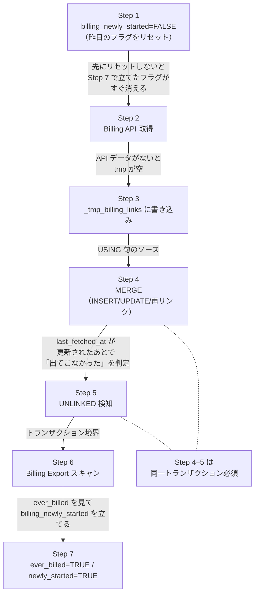
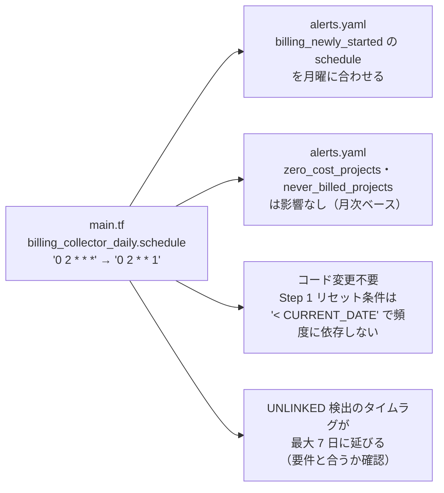
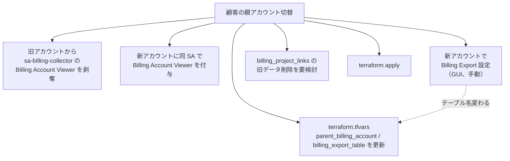
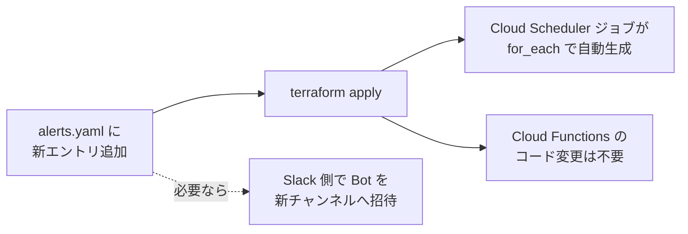
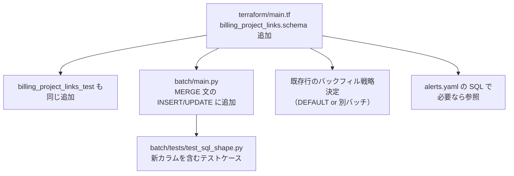

# 自由度と制約

このシステムで **「変えられる」** ものと **「変えられない／順序が固定される」** ものを整理する。新機能追加・運用変更の判断に使う。

> **読み方**: まず §1 で「変えやすい」を見て、§2 で「これは触れない」を確認し、§3 の依存マップで「Xを変えると Y も連動する」を確認する。

______________________________________________________________________

## 1. 自由度（変えられるもの）

### 1-1. 運用パラメータ（即座に変更可・コスト極小）

| 何を変えるか | どこを編集 | 変更コスト | 注意 |
|---|---|---|---|
| **日次バッチの実行時刻** | `main.tf` の `billing_collector_daily.schedule` | `terraform apply` のみ | Billing API のレート制限は十分余裕 |
| **日次バッチの頻度（日次→週次）** | 同上 cron | `terraform apply` + `alerts.yaml` の billing_newly_started の頻度連動 | 詳細 §3-1 |
| **月次バッチの実行日** | `main.tf` の `billing_cost_updater_monthly.schedule` | `terraform apply` のみ | 5日より前は Billing Export 確定前のリスク |
| **アラート発火スケジュール** | `alert/alerts.yaml` の `schedule` | `terraform apply` のみ | 各アラート独立 |
| **アラートの一時停止 / 再開** | `gcloud scheduler jobs pause/resume` | 即時、コード変更なし | アラート単位で個別制御可 |
| **アラート条件 SQL** | `alert/alerts.yaml` の `query` | `terraform apply` のみ | Function コード変更不要（[decisions §3](./decisions.md#3-%E3%82%A2%E3%83%A9%E3%83%BC%E3%83%88%E6%9D%A1%E4%BB%B6%E3%81%AE%E8%A8%98%E8%BF%B0%E8%A8%80%E8%AA%9E%E7%AE%A1%E7%90%86%E6%96%B9%E5%BC%8F)） |
| **アラート通知メッセージ** | `alert/alerts.yaml` の `message` | `terraform apply` のみ | |
| **通知先 Slack チャンネル** | `alert/alerts.yaml` の `channel` | `terraform apply` + Bot 招待 | パブリックチャンネルなら招待不要 |
| **新アラート追加 / 削除** | `alert/alerts.yaml` にエントリ追加/削除 | `terraform apply` のみ | `for_each` で自動生成 |

### 1-2. インフラパラメータ（Terraform で変更可）

| 何を変えるか | どこを編集 | 注意 |
|---|---|---|
| **Cloud Run Job のタイムアウト** | `main.tf` `template.timeout` | 現在 600s。Cloud Run Jobs の上限は 24 時間 |
| **Cloud Run Job のリトライ回数** | `main.tf` `max_retries` | 現在 0（冪等性があるため手動再実行で対応） |
| **Cloud Functions のメモリ・タイムアウト** | `main.tf` `service_config` | 256M / 120s。BigQuery 大量結果でメモリ不足になったら増やす |
| **`maximum_bytes_billed`** | `alert/main.py` `MAX_BYTES_BILLED` | 課金事故防止の上限。10GB |
| **Slack 表示行数の上限** | `alert/main.py` `MAX_ROWS` | 50 行。超過分は「他 N 件」表記 |
| **アラート notification rate limit** | `variables.tf` `monitoring_notification_rate_limit` | metric-threshold ポリシーでは設定不可（log-based のみ）。現状 `alert_strategy` から削除済み |
| **アラート auto-close 時間** | `variables.tf` `monitoring_auto_close` | デフォルト 86400s |

### 1-3. デプロイ・環境（要計画）

| 何を変えるか | どこを編集 | 連動する作業 |
|---|---|---|
| **GCP プロジェクト ID（分析システム側）** | `terraform.tfvars` `project_id` | state 移行、SA 再作成、WIF 再設定、すべての IAM 付け直し。**事実上の再構築** |
| **Billing Export 専用プロジェクト** | `terraform.tfvars` `billing_export_project_id` | Terraform SA に `roles/bigquery.admin` 付与（新プロジェクト側） |
| **親請求先アカウント切替** | `terraform.tfvars` `parent_billing_account` | Billing Export 再設定（GUI）、`sa-billing-collector` の Viewer 権限移行、旧テーブルデータの扱い決定 |
| **Slack ワークスペース切替** | Secret Manager のトークン値 | Bot 再作成、`gcloud secrets versions add slack-bot-token` |
| **GCP リージョン** | `terraform.tfvars` `region` | すべての GCP リソース再作成。Cloud Scheduler の `time_zone` は別変数なので影響なし |
| **CI/CD プラットフォーム（GitHub Actions → 他）** | `.github/workflows/` を移植 | WIF Provider の再設定、Secret/Variables の移行 |

### 1-4. コード実装（実装裁量）

| 領域 | 自由度 |
|---|---|
| Docker base image | `python:3.12-slim` を別 base に差し替え可能。ただし `requirements.txt` の依存解決と Cloud Run の起動時間に影響 |
| BigQuery クライアントの初期化方法 | `bigquery.Client(project=PROJECT_ID)` の引数は任意 |
| ロギング | `google.cloud.logging.Client().setup_logging()` のままだが、別ハンドラに差し替え可能 |
| テストの追加・組織化 | `pyproject.toml` の `testpaths` に従う限り構成自由 |
| Python バージョン | 3.12+。Cloud Functions Gen2 でサポートされる範囲なら上げてよい |

______________________________________________________________________

## 2. 制約（変えられない／順序が固定されるもの）

### 2-1. 論理的制約（バッチ内ステップ順序）

| 制約 | なぜ動かせないか |
|---|---|
| **Step 1（リセット） → Step 7（新規フラグ立て）** | Step 7 で立てたフラグを当日中に消してしまうことを防ぐ。リセット条件 `DATE(last_fetched_at, 'Asia/Tokyo') < CURRENT_DATE` で「昨日以前」のみ消す |
| **Step 2 → Step 3 → Step 4** | データ依存。API 取得 → tmp 書込 → MERGE の USING で参照 |
| **Step 4 → Step 5 同一トランザクション** | UNLINKED 検知は `last_fetched_at < @batch_run_at` で「今回更新されなかった」を見るため、MERGE 直後に判定する。失敗時に部分実行されると整合性が崩れる |
| **Step 6 → Step 7** | Billing Export スキャン結果がないと `ever_billed` の遷移判定ができない |
| **`billing_newly_started=TRUE` は ever_billed FALSE→TRUE のときのみ** | 状態遷移依存。すでに `ever_billed=TRUE` なら立てない（再課金は新規ではないため） |
| **再リンク検出には UNLINKED 状態の履歴行が必要** | 物理削除すると `link_count` インクリメント / `relinked_at` 記録ができない |
| **月次バッチは日次バッチに依存しない（独立）** | 一方で日次バッチが Billing Export を読んで `ever_billed` を更新するため、Billing Export が空だと日次は warning のみで継続できる |

### 2-2. データスキーマ制約

| 制約 | 根拠 |
|---|---|
| **主キー = `(parent_account_id, sub_account_id, project_id)`** | 1 プロジェクト = 1 サブアカウントに 1:1 リンク。複合キーを変えると MERGE / アラート SQL がすべて影響 |
| **`billing_account_id`（Billing Export 内）= サブアカウント ID** | GCP 公式仕様。販売パートナーの場合は親 ID ではなく **サブアカウント ID** が入る（[公式ドキュメント](https://docs.cloud.google.com/billing/docs/how-to/export-data-bigquery-tables/standard-usage)） |
| **`invoice.month` = `YYYYMM` 文字列** | GCP 仕様。月次バッチの WHERE 句がこの形式に依存 |
| **`status` の 4 値（`ACTIVE` / `UNLINKED` / `BILLING_DISABLED` / `SUB_CLOSED`）** | 全アラート SQL がこの enum を前提とした条件分岐を持つ。値の追加・変更は SQL すべてに波及 |
| **タイムスタンプは UTC 保存、表示は JST** | バッチ Python は `datetime.now(timezone.utc)` で生成、SQL の判定は `DATE(..., 'Asia/Tokyo')` で JST 解釈 |
| **`first_billed_month` は `YYYY-MM` 形式（HYPHEN 入り）** | スキーマで明文化。Billing Export の `YYYYMM` とは形式が違うため変換が必要 |

### 2-3. GCP プラットフォームの制約

| 制約 | 影響範囲 |
|---|---|
| **Billing Export 設定は GUI のみ（API/Terraform 不可）** | 初回セットアップが手動。[initial_setup §3-1](./initial_setup.md#3-1-cloud-billing-export-%E3%81%AE%E6%9C%89%E5%8A%B9%E5%8C%96gui%E3%81%AE%E3%81%BFapi%E4%B8%8D%E5%8F%AF) |
| **Billing Export の宛先プロジェクトは、親請求先アカウント直下のプロジェクトのみ選択可** | → **2 プロジェクト構成の理由**。分析システムを別の請求先アカウントに乗せたい場合、Export 専用プロジェクトを別途用意する必要がある |
| **Billing Export データ反映遅延（最大 24 時間）** | 月次バッチを 5 日実行にしている理由。4 日まで遅延しても 1 日のバッファ |
| **Billing Export は設定以降のデータしか入らない** | 過去遡及不可。`ever_billed` / `first_billed_month` は **Export 開始日以降の真実しか語らない** |
| **Cloud Monitoring の Slack 通知チャンネルは API で作れない** | Slack App インストール（GUI）が必須。[initial_setup §4-2](./initial_setup.md#4-2-cloud-monitoring-%E3%81%AE-slack-%E9%80%9A%E7%9F%A5%E3%83%81%E3%83%A3%E3%83%B3%E3%83%8D%E3%83%AB%E4%BD%9C%E6%88%90%E6%89%8B%E5%8B%95) |
| **Cloud Functions Gen2 の IAM ロール = `roles/run.invoker`（Cloud Run レベル）** | `roles/cloudfunctions.invoker` を Cloud Functions レベルに設定しても Cloud Run IAM には伝播しないため不十分。`google_cloud_run_v2_service_iam_member` で `roles/run.invoker` を付与すること |
| **Cloud Monitoring metric-threshold ポリシーの filter は `resource.type` 必須** | log-based metric の場合、元ログの `resource.type`（`cloud_run_job` / `cloud_run_revision`）を指定する。`global` は不正 |
| **Cloud Monitoring の `notification_rate_limit` は log-based ポリシーのみ** | metric-threshold（本システム使用）では `alert_strategy.auto_close` のみ |
| **Cloud Billing API のレート制限とページネーション** | `list_billing_accounts` / `list_project_billing_info` は内部で iterator になっている。1000+ プロジェクトで遅延が出る可能性 |
| **Cloud Run Jobs のタイムアウト上限 = 24 時間** | バッチ処理が想定より長引いた場合の天井 |
| **BigQuery MERGE の同テーブル並行実行はロックで逐次化** | 同時実行を避けるため Cloud Scheduler では 1 ジョブ 1 タスク |

### 2-4. 設計上の意図的制約（変えないと決めたもの）

| 制約 | 理由 |
|---|---|
| **アラート条件は SQL のみ。Python ロジック不可** | デプロイなしで条件変更可能にするため。[decisions §3](./decisions.md#3-%E3%82%A2%E3%83%A9%E3%83%BC%E3%83%88%E6%9D%A1%E4%BB%B6%E3%81%AE%E8%A8%98%E8%BF%B0%E8%A8%80%E8%AA%9E%E7%AE%A1%E7%90%86%E6%96%B9%E5%BC%8F) |
| **Cloud Functions は汎用ハンドラ 1 つのみ** | アラート追加 = YAML 追加だけにするため。[decisions §7](./decisions.md#7-cloud-functions-%E3%81%AE%E8%A8%AD%E8%A8%88%E6%96%B9%E5%BC%8F) |
| **日次・月次バッチは同一 Docker イメージ + `BATCH_TYPE` 環境変数で分岐** | 依存が同じため別イメージのメリットがない。[decisions §10](./decisions.md#10-%E6%9C%88%E6%AC%A1%E3%83%90%E3%83%83%E3%83%81%E3%81%AE%E5%AE%9F%E8%A3%85%E6%96%B9%E5%BC%8F) |
| **GitHub Actions + Workload Identity Federation** | SA キーを発行しないセキュリティポリシー。[decisions §8](./decisions.md#8-cicd-%E5%9F%BA%E7%9B%A4) |
| **`terraform.tfvars` は `.gitignore`** | 機密情報を Git に入れない。CI では GitHub Variables/Secrets 経由 |
| **Slack 通知は Bot Token + `chat.postMessage`、Incoming Webhook 不採用** | 1 トークンで複数チャンネル切替できる必要がある。[decisions §9](./decisions.md#9-slack-%E9%80%9A%E7%9F%A5%E6%96%B9%E5%BC%8F) |
| **アラート基盤は Cloud Functions、Cloud Monitoring Alerting Policy ではない** | SQL 条件が最優先要件のため。Cloud Monitoring はメトリクス閾値専用。[decisions §6](./decisions.md#6-%E3%82%A2%E3%83%A9%E3%83%BC%E3%83%88%E5%9F%BA%E7%9B%A4cloud-monitoring-%E3%83%8D%E3%82%A4%E3%83%86%E3%82%A3%E3%83%96-vs-cloud-functions) |
| **物理削除しない（UNLINKED 論理削除）** | 再リンク検出と履歴分析のため |

### 2-5. 暗黙の制約（変えると周辺が崩れる）

| 制約 | 影響 |
|---|---|
| **リージョン = `asia-northeast1`** | 全 GCP リソースが同 region 前提。multi-region 化は Scheduler / Cloud Run / BQ の整合性検討が必要 |
| **Python = 3.12** | Cloud Functions Gen2 のランタイム指定とローカル開発で揃える必要がある |
| **Terraform = 1.6+** | `backend "gcs"` の部分初期化（`-backend-config`）に依存 |
| **Slack Bot Token を 1 つで全チャンネルカバー** | 複数ワークスペースに通知したい場合は Bot を分けて Secret も増やす必要 |

______________________________________________________________________

## 3. 依存マップ（X を変えると Y も連動する）

### 3-1. バッチ頻度を変える（日次→週次）

**ポイント**: `billing_newly_started` フラグは「次回バッチでリセット」される設計のため、週次にするとフラグが翌日以降も `TRUE` のままになり、`schedule` が日次のままだと連続通知される。同期させること。

詳細は [decisions §1](./decisions.md#1-%E3%83%90%E3%83%83%E3%83%81%E5%AE%9F%E8%A1%8C%E9%A0%BB%E5%BA%A6)。

### 3-2. 親請求先アカウントを切り替える

**ポイント**: テーブル名 `gcp_billing_export_v1_XXXXXX_YYYYYY` が新アカウントごとに変わるので、Cloud Run Jobs の環境変数を必ず更新する。

### 3-3. 新しいアラートを増やす

### 3-4. テーブルスキーマにカラムを足す

**ポイント**: BigQuery のスキーマ追加は **NULLABLE のみ後付け可能**。REQUIRED で追加したい場合はテーブル再作成 + バックフィルが必要。

### 3-5. アラート条件に Billing Export のカラムを使いたい

現状の `alert_handler` は `{project}/{dataset}` を分析プロジェクトのものに置換するだけ。Billing Export を **別プロジェクト** に置いている構成では、アラート SQL から直接参照するには：

- (A) `alert/main.py` で `{export_project}/{export_dataset}/{export_table}` も置換対象に増やす
- (B) 日次バッチで集約したカラムを `billing_project_links` に書き込んでおく（推奨）

(B) のほうが SQL もシンプル、`maximum_bytes_billed` の制御も容易。

______________________________________________________________________

## 4. 「何を変える」と「何を見るか」早見表

| やりたいこと | 自由度ランク | 見るドキュメント |
|---|---|---|
| バッチ時刻を変える | ⭐⭐⭐ 即時 | この §1-1 |
| アラート条件を変える | ⭐⭐⭐ 即時 | [alert_design.md](./alert_design.md) §3 |
| アラートを停止する | ⭐⭐⭐ 即時 | [operations.md](./operations.md) §アラート停止 |
| 新しいアラートを追加 | ⭐⭐⭐ 即時 | [alert_design.md](./alert_design.md) §3、§3-3 |
| Slack 通知先を変える | ⭐⭐ 短期 | この §3、[operations.md](./operations.md) §Slack |
| バッチ頻度（日次→週次） | ⭐⭐ 短期 | この §3-1、[decisions §1](./decisions.md#1-%E3%83%90%E3%83%83%E3%83%81%E5%AE%9F%E8%A1%8C%E9%A0%BB%E5%BA%A6) |
| 親請求先アカウント切替 | ⭐ 中期 | この §3-2、[operations.md](./operations.md) §設定変更 |
| 分析プロジェクト ID 変更 | × 大規模 | 事実上の再構築。state 移行・WIF 再設定 |
| `status` に新値追加 | × 影響大 | すべてのアラート SQL を確認 |
| バッチ Step 順序変更 | × 不可 | §2-1 の依存図参照 |

______________________________________________________________________

## 5. 拡張時の安全網

新機能を追加する前に、次のチェックリストで影響範囲を見積もる：

- [ ] **データ依存**: 新しい処理は既存ステップの出力に依存しないか？順序制約に違反しないか？
- [ ] **スキーマ依存**: 新カラムを足す場合、既存行のバックフィル戦略は？
- [ ] **アラート SQL 影響**: `status` / `ever_billed` / `billing_newly_started` の意味を変えると全アラートに波及
- [ ] **コスト影響**: BigQuery スキャン量 / Cloud Run 実行時間 / Cloud Functions 呼出回数の増加見積もり
- [ ] **GCP 制約**: その機能が GUI 必須ではないか？API 制限はないか？
- [ ] **テスト**: 新ロジックが [`testing.md`](./testing.md) の 3 層構造でカバーできるか？
- [ ] **冪等性**: 手動再実行で安全か？

______________________________________________________________________

## 関連ドキュメント

- データフロー詳細: [architecture.md](./architecture.md)
- 用語: [glossary.md](./glossary.md)
- 設計判断の経緯: [decisions.md](./decisions.md)
- 運用変更の手順: [operations.md](./operations.md)
