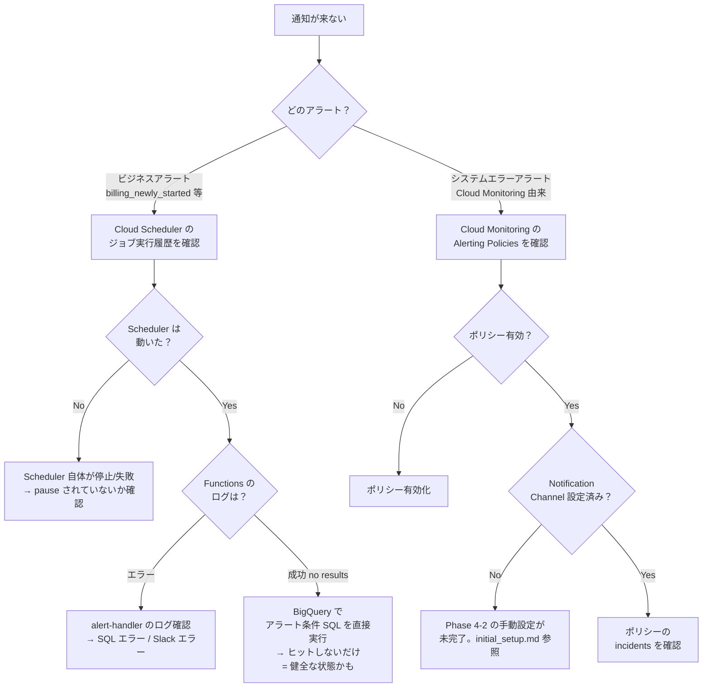
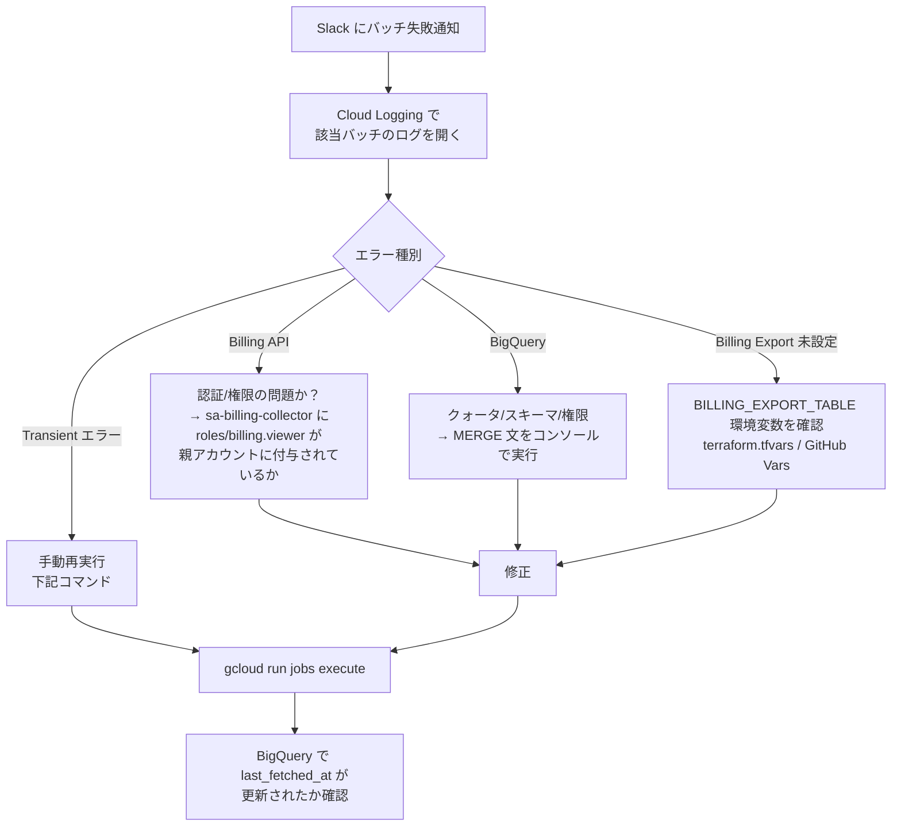
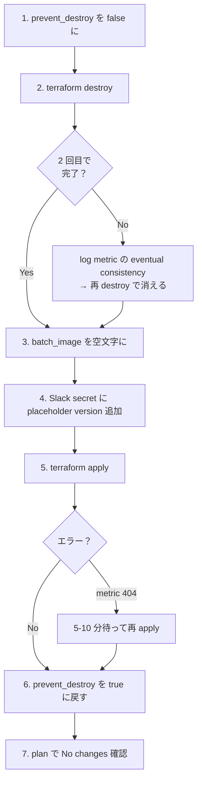

# 運用ランブック

日常運用と障害対応をまとめたページ。**オンコール時はまずここを見る**。

> **コマンド例の `${GCP_PROJECT_ID}`** は実際の分析システム側プロジェクト ID に置き換える。
> Billing Export 専用プロジェクトを使っている場合は、Billing Export のクエリでは `${BILLING_EXPORT_PROJECT_ID}` を使う。

______________________________________________________________________

## 障害対応フロー

### 「Slack に何の通知も来ない」



### 「バッチが失敗した」

Cloud Monitoring が `billing-collector` / `billing-cost-updater` の ERROR ログを拾って Slack に通知する。通知が来たら：



> **`BILLING_EXPORT_TABLE` 未設定時の挙動（日次 vs 月次の非対称）**
>
> | バッチ | 挙動 | 理由 |
> |---|---|---|
> | 日次 `billing-collector` | `step6_7`（ever_billed 更新）を warning ログでスキップして正常終了 | リンク情報の収集だけは継続したい。Billing Export 設定前でも日次は動作可 |
> | 月次 `billing-cost-updater` | `ValueError` で即失敗 | 月次の主目的は前月コスト集計のため、Billing Export なしでは存在意義がない |
>
> Billing Export 設定前（初回構築中）は月次バッチがエラーになるのが正常。`BILLING_EXPORT_TABLE` を設定すれば解消する。

______________________________________________________________________

## 日常運用タスク

### バッチ手動再実行

冪等性があるため安全に再実行できる。

```bash
# 日次バッチ
gcloud run jobs execute billing-collector \
  --region=asia-northeast1 \
  --project=${GCP_PROJECT_ID}

# 月次バッチ
gcloud run jobs execute billing-cost-updater \
  --region=asia-northeast1 \
  --project=${GCP_PROJECT_ID}

# 実行履歴
gcloud run jobs executions list \
  --job=billing-collector \
  --region=asia-northeast1 \
  --project=${GCP_PROJECT_ID}
```

### アラートを一時停止 / 再開

```bash
# 一時停止（pause）— コード変更・デプロイ不要
gcloud scheduler jobs pause alert-billing_newly_started \
  --location=asia-northeast1 \
  --project=${GCP_PROJECT_ID}

# 再開（resume）
gcloud scheduler jobs resume alert-billing_newly_started \
  --location=asia-northeast1 \
  --project=${GCP_PROJECT_ID}

# 全アラートを一覧
gcloud scheduler jobs list \
  --location=asia-northeast1 \
  --project=${GCP_PROJECT_ID} \
  --filter="name:alert-*"
```

### アラートを手動発火（テスト用）

定刻を待たずに通知をテストできる。

```bash
gcloud scheduler jobs run alert-billing_newly_started \
  --location=asia-northeast1 \
  --project=${GCP_PROJECT_ID}
```

### アラート条件 SQL の事前確認

`alerts.yaml` の `query` を変更する前に、BigQuery コンソールで動作確認する：

```sql
-- alerts.yaml の query をコピー、{project}/{dataset} を実値に置換して実行
SELECT *
FROM `${GCP_PROJECT_ID}.billing_data.billing_project_links`
WHERE ...
```

### アラート追加 / 変更 / 削除

`alert/alerts.yaml` を編集 → `terraform apply` だけ。Function コードは触らない。

```bash
# 例: 新しいアラートを追加
vim alert/alerts.yaml
cd terraform
terraform plan
terraform apply
```

詳細は [alert_design.md](./alert_design.md) §3。

### Slack 通知先チャンネルの変更

1. `alert/alerts.yaml` の対象アラートの `channel` を変更
1. Slack 側で Bot をそのチャンネルに招待（パブリックなら `chat:write.public` で不要）
1. `terraform apply`

______________________________________________________________________

## 監視ダッシュボード

| 確認したいこと | 場所 |
|---|---|
| バッチの直近 7 日の成功/失敗 | GCP コンソール → Cloud Run → billing-collector → Executions |
| バッチ実行時間の推移 | Cloud Monitoring → Metrics Explorer → `run.googleapis.com/job/completed_execution_count` |
| 構造化ログのクエリ | Cloud Logging → `resource.type="cloud_run_job"` + `json_fields.run_id=...` |
| Functions の呼び出し回数 | Cloud Functions → alert-handler → Metrics |
| BigQuery のスキャン量 | BigQuery → Project History |
| アラートポリシーの発火履歴 | Cloud Monitoring → Alerting → Incidents |

______________________________________________________________________

## データ整合性チェック

### 「`billing_project_links` の件数が想定と違う」

```sql
-- Status 別の件数
SELECT status, COUNT(*) AS cnt
FROM `${GCP_PROJECT_ID}.billing_data.billing_project_links`
GROUP BY status
ORDER BY cnt DESC;

-- 最終バッチ実行時刻（最新の last_fetched_at）
SELECT MAX(last_fetched_at) AS last_batch
FROM `${GCP_PROJECT_ID}.billing_data.billing_project_links`;

-- billing_newly_started=TRUE のレコード（バッチ翌日にはリセットされるはず）
SELECT *
FROM `${GCP_PROJECT_ID}.billing_data.billing_project_links`
WHERE billing_newly_started = TRUE;
```

### 「Billing Export と数字が合わない」

Billing Export は **最大 24 時間遅延** するため、即時の整合性は期待できない。月次バッチが 5 日に走るのもこの遅延を加味している（4 日まで遅延しても 1 日のバッファを確保）。

```sql
-- Billing Export の最新タイムスタンプ
SELECT MAX(export_time) AS latest_export
FROM `billing-export-project.billing_data.gcp_billing_export_v1_XXX`;
```

______________________________________________________________________

## デプロイ・ロールバック

### 通常デプロイ

`main` ブランチに push されると GitHub Actions が自動で：

1. lint-and-test ジョブ実行（pytest + terraform fmt/validate）
1. Docker build & push（タグは `${{ github.sha }}`）
1. `terraform apply -auto-approve`

詳細は [.github/workflows/deploy.yml](../.github/workflows/deploy.yml)。

### Docker イメージを過去版に戻す

```bash
# 過去のタグを一覧
gcloud artifacts docker images list \
  asia-northeast1-docker.pkg.dev/${GCP_PROJECT_ID}/billing-link-detection \
  --include-tags

# 戻したいコミット SHA で Cloud Run Job を直接更新
gcloud run jobs update billing-collector \
  --image=asia-northeast1-docker.pkg.dev/${GCP_PROJECT_ID}/billing-link-detection/billing-collector:OLD_SHA \
  --region=asia-northeast1

# 同様に billing-cost-updater
```

> **注意**: Terraform state とズレるため、必ず `terraform.tfvars` か CI の `TF_VAR_batch_image` も更新してから次の apply を走らせること。

### Terraform 単独のロールバック

```bash
# 直近の state バックアップ確認
gsutil ls gs://${GCP_PROJECT_ID}-tfstate/terraform/state/

# state を巻き戻したいケースは稀。通常は git revert → push で十分
git revert <bad_commit>
git push origin main  # CI で自動 apply
```

### Slack Bot Token をローテーション

```bash
# 新トークンを Secret Manager に追加（バージョンが増える）
echo -n "xoxb-NEW-TOKEN" | \
  gcloud secrets versions add slack-bot-token \
    --data-file=- \
    --project=${GCP_PROJECT_ID}

# Cloud Functions は `version=latest` 参照なので自動で新トークンを使う
# 念のため次回 Function 起動を待たず再デプロイしたい場合：
gcloud functions deploy alert-handler --region=asia-northeast1
```

### 全リソースを destroy → apply で作り直す（検証・大規模変更用）

通常は不要。**Terraform state のクリーンアップ・スキーマ大幅変更・別プロジェクトへの移行などで全リソースをゼロから再構築したい場合の手順**。

> **警告**: BigQuery テーブル・Secret Manager・Cloud Run Jobs などをすべて削除する。BigQuery のデータは永久消失する（`billing_project_links` の履歴含む）。本番で実施する前に BQ Export 等でバックアップを取ること。



**手順詳細**

1. `terraform/main.tf` で `billing_project_links` の `prevent_destroy = true` → `false` に変更

   ```hcl
   lifecycle {
     prevent_destroy = false # TEMPORARY: destroy 検証中。終了後 true に戻す
   }
   ```

1. destroy 実行

   ```bash
   cd terraform
   terraform destroy -auto-approve
   ```

   > **既知の問題**: log-based metric が「alerting policy にまだ使われている」エラーで 1〜2 件残ることがある（GCP の eventual consistency）。`terraform destroy` を **もう一度実行すれば消える**。

1. `terraform/terraform.tfvars` の `batch_image` を空文字に変更

   ```hcl
   batch_image = "" # locals で python:3.12-slim にフォールバック
   ```

   理由: Artifact Registry も destroy で消えているため、既存タグ（`v1.0.0` 等）を指定してもイメージが存在せず Cloud Run Jobs の作成が失敗する。

1. Slack secret に placeholder バージョンを投入

   ```bash
   echo -n "placeholder" | \
     gcloud secrets versions add slack-bot-token \
       --data-file=- \
       --project=${GCP_PROJECT_ID}
   ```

   理由: `google_secret_manager_secret` リソースは secret 本体だけ作るため `version=latest` が空になり、Cloud Function の起動に失敗する。

1. apply 実行

   ```bash
   terraform apply -auto-approve
   ```

   > **既知の問題**: 新規作成した log-based metric が、直後に alerting policy から参照される際に「metric not found」エラー（404）になる。これは GCP 側の eventual consistency（最大 10 分）で解消する。**5〜10 分後に再 apply** すればパスする。

1. `prevent_destroy = true` に戻す（main.tf）

1. 動作確認

   ```bash
   terraform plan
   # → "No changes" であること
   ```

1. **稼働再開のための追加作業**:

   - Slack Bot Token を placeholder から本物に置き換える（[Slack Bot Token をローテーション](#slack-bot-token-%E3%82%92%E3%83%AD%E3%83%BC%E3%83%86%E3%83%BC%E3%82%B7%E3%83%A7%E3%83%B3) 参照）
   - Docker イメージを Artifact Registry に push し直す（CI/CD で `main` に push すれば自動）
   - `batch_image` を本物のタグに戻す（`terraform.tfvars` または GitHub Variables）

______________________________________________________________________

## 設定変更時のチェックリスト

### Slack チャンネルを増やす場合

- [ ] Slack でチャンネル作成、Bot 招待（パブリックなら不要）
- [ ] `alert/alerts.yaml` で対象アラートの `channel` を更新（または新規アラート追加）
- [ ] `terraform apply`
- [ ] `gcloud scheduler jobs run` でテスト通知

### `parent_billing_account` を変更する場合（顧客親アカウント切替）

- [ ] 旧親アカウントから sa-billing-collector の Billing Account Viewer を剥奪
- [ ] 新親アカウントに同 SA で Billing Account Viewer を付与
- [ ] Billing Export 設定を新親アカウントで有効化
- [ ] `terraform.tfvars` の `parent_billing_account` と `billing_export_table` を更新
- [ ] `terraform apply`
- [ ] `billing_project_links` をクリア（旧データ削除）するかは要件次第

### 新しいアラートを追加する場合

[alert_design.md](./alert_design.md) §3 のテンプレートを参照。

______________________________________________________________________

## 関連リンク

- 全体構成: [architecture.md](./architecture.md)
- 用語の意味: [glossary.md](./glossary.md)
- アラート設計: [alert_design.md](./alert_design.md)
- 初回セットアップ: [initial_setup.md](./initial_setup.md)
- なぜこの設計か: [decisions.md](./decisions.md)
