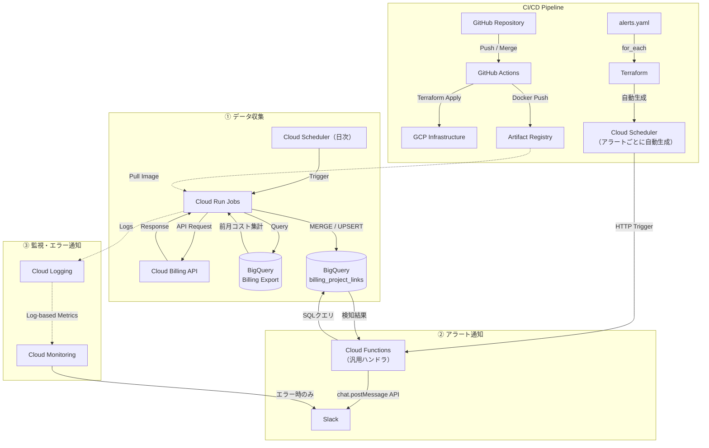

# Google Cloud Billing リンク情報収集バッチ 要件定義書

## 1. プロジェクト概要

親の請求先アカウントに紐づくサブアカウント、およびそれらにリンクされているGoogle Cloudプロジェクトの情報を定期的に取得し、BigQueryのテーブル（`billing_project_links`）に蓄積・同期するバッチシステムを構築する。

> **初回セットアップについて**: `terraform apply` だけでは構築できない手動作業（プロジェクト作成・請求先リンク・Terraform用stateバケット・Billing Export有効化など）は [`initial_setup.md`](./initial_setup.md) を参照。

## 2. アーキテクチャ図

本システムはサーバーレスアーキテクチャを採用し、運用コストを最小化しつつ可用性を確保する。\
データ収集とアラート通知は独立した2つのサブシステムで構成する。



## 3. システムコンポーネントと技術スタック

### データ収集

- **実行環境**: Cloud Run Jobs（定期実行バッチスクリプトに最適）
- **トリガー**: Cloud Scheduler（cron形式で実行間隔を制御）
- **アプリケーション言語**: Python 3.12+（Google Cloud Client Library使用）
- **データストア**: BigQuery（履歴管理・分析用データウェアハウス）
- **課金金額データソース**: Cloud Billing Export to BigQuery（事前に有効化が必要。プロジェクト別・月別コストの集計に使用）
- **コンテナ設計**: 日次・月次の2ジョブは同一コンテナイメージを使用し、環境変数 `BATCH_TYPE`（`daily` / `monthly`）で処理を切り替える。採用理由は [`decisions.md`](./decisions.md)「10. 月次バッチの実装方式」を参照

### アラート通知

- **アラートハンドラ**: Cloud Functions Gen2（汎用ハンドラ1つで全アラートを処理）
- **アラートトリガー**: Cloud Scheduler（alerts.yaml のエントリ数だけTerraformが自動生成）
- **アラート条件管理**: alerts.yaml（SQL WHERE句で条件を定義。Terraform for_each でSchedulerジョブを動的生成）
- **通知先**: Slack Bot Token + `chat.postMessage` API（チャンネルごとに通知先を切り替えるため Incoming Webhook は採用しない）

### 共通

- **IaC**: Terraform（インフラのバージョン管理と冪等性の担保）
- **監視・エラー通知**: Cloud Logging + Cloud Monitoring（エラーログ検知時にSlack通知）
- **CI/CD**: GitHub Actions（Lint, Test, Terraform Apply, Container Build & Push）。GCP 認証は Workload Identity Federation を使用し、サービスアカウントキーの発行・管理を不要にする

### リージョン

| リソース | リージョン | 備考 |
|---|---|---|
| BigQuery データセット（`billing_data`） | `asia-northeast1` | 東京 |
| Cloud Run Jobs（データ収集バッチ） | `asia-northeast1` | BQと同一リージョンでデータ転送料金・遅延を最小化 |
| Cloud Functions（アラートハンドラ） | `asia-northeast1` | 同上 |
| Cloud Scheduler | `asia-northeast1` | 同上 |
| Artifact Registry | `asia-northeast1` | 同上 |
| GCS（Terraform state, Functions ソース） | `asia-northeast1` | 同上 |
| Secret Manager | （automatic / multi-region） | デフォルトの自動レプリケーション |
| Workload Identity Federation Pool/Provider | `global` | GCP 仕様により global 固定 |

Billing Export テーブルのリージョンは設定時に選択するが、本システムの BQ データセットと同一の `asia-northeast1` を選択する。

## 4. 実行頻度

**日次実行**を採用する。選定理由の詳細な比較は [`decisions.md`](./decisions.md)「1. バッチ実行頻度」を参照。

### バッチ実行時刻

| ジョブ名（Cloud Run Job） | cron（JST） | `BATCH_TYPE` | 用途 |
|---|---|---|---|
| `billing-collector` | `0 2 * * *`（毎日 02:00） | `daily`（デフォルト） | Billing API からリンク情報収集・BQ MERGE、Billing Export 全期間スキャンによる `ever_billed` / `first_billed_month` / `billing_newly_started` の更新 |
| `billing-cost-updater` | `0 3 5 * *`（毎月5日 03:00） | `monthly` | Billing Export から前月確定コストを集計し `prev_month_cost` / `cost_currency` のみを更新 |

> 毎月5日を選定した理由: Billing Export のデータ確定に最大72時間かかる。月初1〜3日は前月データが揃っていない可能性があるため、余裕を持って5日とした。\
> 03:00 を選定した理由: 毎月5日は日次バッチ（02:00）と月次バッチが同日に実行される。同一テーブルへの並列 MERGE を避けるため、日次バッチ完了を見込んで1時間後の 03:00 とした。

> **タイムゾーン指定**: 上記の cron はすべて JST 前提のため、Cloud Scheduler リソースには `time_zone = "Asia/Tokyo"` を明示する。UTC 既定値で実行すると9時間ずれて深夜帯（17:00 / 18:00 UTC）に動作するため、実装時に必須の設定項目。

```hcl
# 日次バッチ用 Cloud Scheduler
resource "google_cloud_scheduler_job" "billing_collector_daily" {
  name      = "billing-collector-daily"
  schedule  = "0 2 * * *"
  time_zone = "Asia/Tokyo"   # ← 明示必須
  region    = var.region

  http_target {
    http_method = "POST"
    uri         = "https://${var.region}-run.googleapis.com/apis/run.googleapis.com/v1/namespaces/${var.project_id}/jobs/billing-collector:run"
    oauth_token {
      service_account_email = google_service_account.scheduler.email
    }
  }
}

# 月次バッチ用 Cloud Scheduler（BATCH_TYPE=monthly は Cloud Run Job 側で設定済み）
resource "google_cloud_scheduler_job" "billing_cost_updater_monthly" {
  name      = "billing-cost-updater-monthly"
  schedule  = "0 3 5 * *"
  time_zone = "Asia/Tokyo"
  region    = var.region

  http_target {
    http_method = "POST"
    uri         = "https://${var.region}-run.googleapis.com/apis/run.googleapis.com/v1/namespaces/${var.project_id}/jobs/billing-cost-updater:run"
    oauth_token {
      service_account_email = google_service_account.scheduler.email
    }
  }
}
```

### バッチ責務の分担方針

`ever_billed` と `billing_newly_started` は連動する（後者は前者の FALSE→TRUE 遷移を表す）ため、**両方とも日次バッチで処理する**。これにより以下が成立する。

- 「課金開始の即時検知」要件（Section 9-3）を満たす（月次検知だと最大1ヶ月遅延する）
- フラグの整合性が1つのバッチ内で完結する（バッチ間の連動による不整合リスクを排除）
- Billing Export の全期間スキャンは 300 プロジェクト規模で月数GB以下のため、無料枠1TB/月の0.1%未満で無視可能なコスト

月次バッチは「Billing Export の確定値を待たないと正確な値が出せない `prev_month_cost`」専用とし、責務を最小化する。

## 5. 月額のCloud費用見積もり（概算）

本システムは非常に軽量なバッチ処理であるため、ほとんどが無料枠（Free Tier）に収まり、**月額費用はほぼ$0〜数ドル程度**となる見込み。

- **Cloud Run Jobs**: 月に30回（毎日1回）+ 月1回、数分程度の実行。無料枠（毎月200万リクエスト、36万GB秒）内に完全におさまる。 **($0.00)**
- **Cloud Scheduler**: データ収集2ジョブ（日次・月次） + アラート5ジョブ = 計7ジョブ。3ジョブまで無料、超過分は$0.10/job/月。超過4ジョブ分 **($0.00〜$0.40)**
- **Cloud Functions**: アラートハンドラ。無料枠200万回/月に対して数十〜数百回の実行。 **($0.00)**
- **BigQuery**: ストレージ（毎月10GB無料）、クエリ（毎月1TB無料）。データ量はKB〜MBクラスのため無料枠内。 **($0.00)**
- **Cloud Logging / Monitoring**: 毎月50GBまで無料。メトリクスやアラートも標準機能の範囲内。 **($0.00)**
- **Artifact Registry**: 毎月0.5GB無料。イメージサイズによるが、数十円〜数百円程度。 **($0.10 〜 $1.00)**
- **CI/CD (GitHub Actions)**: パブリックリポジトリは無制限。プライベートでも無料枠2000分/月で十分。 **($0.00)**
- **合計見積もり**: **$0.10 〜 $1.40 / 月**（Cloud Schedulerの超過ジョブ分含む）

## 6. データ定義（BigQuery テーブル仕様）

### データセット

| 項目 | 値 |
|---|---|
| データセット名 | `billing_data` |
| ロケーション | `asia-northeast1`（東京） |
| テーブル名 | `billing_project_links` |

**主キー**: `(parent_account_id, sub_account_id, project_id)`

### テーブルスキーマ

| カラム名 | データ型 | 説明 |
| --- | --- | --- |
| parent_account_id | STRING | 親請求先アカウントID |
| sub_account_id | STRING | 請求先サブアカウントID |
| sub_account_name | STRING | サブアカウントの表示名 |
| project_id | STRING | Google Cloud プロジェクトID |
| billing_enabled | BOOLEAN | 課金有効状態 |
| sub_account_open | BOOLEAN | サブアカウントがオープンかどうか |
| status | STRING | `ACTIVE` / `UNLINKED` / `BILLING_DISABLED` / `SUB_CLOSED` |
| linked_at | TIMESTAMP | 最初にリンクを確認した日時 |
| unlinked_at | TIMESTAMP | 最後にアンリンクされた日時（NULL = 現在リンク中） |
| relinked_at | TIMESTAMP | 最後に再リンクされた日時（NULL = 再リンク経験なし） |
| link_count | INTEGER | リンク回数（再リンクのたびにインクリメント） |
| last_fetched_at | TIMESTAMP | バッチがBilling APIからこのレコードのデータを取得した最後の日時。APIレスポンスに含まれていた全プロジェクトを毎回更新する。APIに現れなくなったプロジェクトは更新されないため、UNLINKEDへの状態遷移検知に使用する |
| updated_at | TIMESTAMP | レコードの内容（ステータス・課金状態・リンク情報など）が実際に変化したときのみ更新する日時。last_fetched_at と異なり、変化がなければ更新されない |
| prev_month_cost | FLOAT64 | 前月の請求金額。NULL = データ未取得 |
| cost_currency | STRING | 前月請求金額の通貨コード（例: `USD`）。prev_month_cost と対応する。NULL = 未取得 |
| ever_billed | BOOLEAN | これまでに一度でも課金実績があるか（前月コスト > 0 の月が存在するか） |
| first_billed_month | STRING | 初回課金月（YYYY-MM形式。ever_billed = FALSE の場合は NULL） |
| billing_newly_started | BOOLEAN | 当バッチ実行で初めて課金を確認したか（ever_billed が FALSE → TRUE に遷移したタイミングのみ TRUE） |

### テーブル作成の管理

`billing_data` データセットおよび `billing_project_links` テーブルは **Terraform で管理する**（`google_bigquery_dataset` / `google_bigquery_table` リソース）。バッチコードが実行時にテーブルを動的作成する方式は採用しない。スキーマ変更は Terraform のリソース定義を修正して `terraform apply` で適用する。

### UNLINKEDレコードの保持方針

UNLINKED になったレコードは削除せず **`billing_project_links` に永続保持する**。

30顧客・300プロジェクト規模ではテーブルの総行数が数百件であり、UNLINKED レコードが数年分蓄積しても1,000件を超えることはほぼない。パフォーマンス上の問題は生じないため、定期削除のバッチや TTL 設定は設けない。UNLINKED レコードを残すことで、過去のリンク履歴（`linked_at` / `unlinked_at` / `link_count`）を分析に活用できる。

### 更新方式

**BigQuery MERGE 文（UPSERT）** を採用する。バッチ実行のたびに Billing API から取得したデータを一時テーブルに格納し、`billing_project_links` に対して MERGE を実行する。新規レコードは INSERT、既存レコードは変化があった項目のみ UPDATE する。UNLINKED の検知は MERGE の後処理として、`last_fetched_at` が今回のバッチ実行時刻で更新されていないアクティブなレコードを UNLINKED に切り替える UPDATE 文で実現する。

### ステータス遷移ルール

| 遷移パターン | 条件 | status の値 |
|---|---|---|
| 通常稼働 | APIレスポンスに含まれ、`billing_enabled = TRUE`、`sub_account_open = TRUE` | `ACTIVE` |
| 課金無効化 | APIレスポンスに含まれ、`billing_enabled = FALSE` | `BILLING_DISABLED` |
| サブアカウント閉鎖 | APIレスポンスに含まれ、`sub_account_open = FALSE` | `SUB_CLOSED` |
| アンリンク検知 | 前回バッチ以降 APIレスポンスに含まれない（`last_fetched_at` が更新されない） | `UNLINKED` |
| 再リンク | `UNLINKED` 状態から再びAPIレスポンスに出現 | `ACTIVE` / `BILLING_DISABLED` / `SUB_CLOSED`（`billing_enabled` / `sub_account_open` に基づき判定。新規 INSERT 時と同一ロジック）。`relinked_at` 更新・`link_count` インクリメントは遷移先によらず実施 |

### MERGE 処理のカラム別挙動

| カラム | 新規 INSERT 時 | 既存レコード MATCHED 時 | UNLINKED 検知時（後処理 UPDATE） |
|---|---|---|---|
| parent_account_id | セット | 変更なし | 変更なし |
| sub_account_id | セット | 変更なし | 変更なし |
| sub_account_name | セット | 変化があれば上書き（NULL を含む比較は `IS DISTINCT FROM` を使用） | 変更なし |
| project_id | セット | 変更なし | 変更なし |
| billing_enabled | セット | 最新値で上書き | 変更なし |
| sub_account_open | セット | 最新値で上書き | 変更なし |
| status | `billing_enabled` / `sub_account_open` から判定（`ACTIVE` / `BILLING_DISABLED` / `SUB_CLOSED`） | ルールに従い更新 | `UNLINKED` |
| linked_at | バッチ実行時刻 | 変更なし | 変更なし |
| unlinked_at | NULL | 変更なし（再リンク時は NULL にリセット） | バッチ実行時刻 |
| relinked_at | NULL | 再リンク時のみバッチ実行時刻 | 変更なし |
| link_count | 1 | 再リンク時のみ +1 | 変更なし |
| last_fetched_at | `@batch_run_at` | `@batch_run_at` で上書き | 変更なし（未更新であることがUNLINKEDの判定条件） |
| updated_at | バッチ実行時刻 | 内容に変化があった場合のみ上書き | バッチ実行時刻 |
| prev_month_cost | NULL | 月次バッチで上書き | 変更なし |
| cost_currency | NULL | 月次バッチで上書き | 変更なし |
| ever_billed | FALSE | 日次バッチで更新（一度 TRUE になったら以降は変更なし） | 変更なし |
| first_billed_month | NULL | 日次バッチで更新。初回確定後も `source < target` の場合（より古い月が判明した場合）のみ上書き（前倒し方向のみ許容） | 変更なし |
| billing_newly_started | FALSE | 日次バッチで `ever_billed` の FALSE→TRUE 遷移時に TRUE、次バッチで FALSE にリセット | 変更なし |

### 日次バッチの処理フロー

```
[Step 1] billing_newly_started のリセット
  - 前回実行日と異なる日付の場合のみ、全レコードを FALSE に
  - 同日再実行ではスキップ → 二重通知の防止

[Step 2] Billing API データ取得（全サブアカウント・全プロジェクト）
  - エラー発生時は即時中断（部分データでの MERGE を避ける）

[Step 3] 取得データを一時テーブル (`_tmp_billing_links`) へ全件書き込み

[Step 4 + Step 5] MERGE + UNLINKED 後処理（BEGIN TRANSACTION / COMMIT で同一トランザクション）
  Step 4 が成功して Step 5 が失敗すると last_fetched_at 更新済み・UNLINKED 未設定の不整合が残るため、
  BigQuery の BEGIN TRANSACTION / COMMIT で2ステートメントをアトミックに実行する。

[Step 4] MERGE: 一時テーブル → billing_project_links
  - WHEN MATCHED 句の評価順序: 「UNLINKED 判定（再リンク）」を先、「無条件 WHEN MATCHED（通常更新）」を後に記述する
    （順序を誤ると再リンク分岐が無視されるため）
  - 新規 → INSERT（linked_at = @batch_run_at、link_count = 1、status は billing_enabled / sub_account_open から判定）
  - 既存（UNLINKED）→ 再リンク: billing_enabled / sub_account_open でステータスを再評価し relinked_at セット・link_count +1
  - 既存（UNLINKED 以外）→ 通常 UPDATE: last_fetched_at = @batch_run_at、変化があれば updated_at も更新
  - 「今回バッチ実行時刻」はすべて Python 側で固定した `@batch_run_at` パラメータを使用する
    （CURRENT_TIMESTAMP() を SQL 内で呼ぶと Step 4/5 間でタイムスタンプがずれ UNLINKED 判定が壊れる）

[Step 5] UNLINKED 後処理 UPDATE（Step 4 と同一トランザクション内）
  - last_fetched_at < @batch_run_at かつ status != 'UNLINKED' のレコードを UNLINKED に
  - 対象は ACTIVE / BILLING_DISABLED / SUB_CLOSED すべてを含む（APIから消えた理由を問わず一律に遷移）
  - unlinked_at = @batch_run_at をセット
  - 既に UNLINKED のレコードは対象外のため、同日2回実行で連続して消えていても unlinked_at は初回のままで維持される
  - 同日中に 再リンク → 再び消えた 場合は、再リンク時に unlinked_at が NULL リセット済みのため、今回バッチで再セットされる（最新時刻で上書き）

[Step 6] Billing Export 全期間スキャン
  - プロジェクト別に SUM(cost) > 0 を判定し、first_billed_month（MIN(invoice.month)）を算出

[Step 7] MERGE: ever_billed / first_billed_month / billing_newly_started 更新
  - ever_billed は status を問わず全レコードを更新（UNLINKED 含む）。一度 TRUE になったら以降変更なし
  - first_billed_month は status を問わず全レコードを更新（UNLINKED 含む）。
    初回確定後も source < target（より古い月が判明）の場合のみ上書き（前倒し方向のみ許容）
    → MIN(invoice.month) は新データ追加により小さくなる方向にしか変化しないため、この条件で遅延反映に対応できる
  - billing_newly_started = TRUE のセットは status != 'UNLINKED' のレコードのみ
    → アンリンク済みプロジェクトへの「課金開始」アラートを防ぐ
```

エラー発生時は Step を完了せず即時中断し、非ゼロ終了コードで Cloud Monitoring に検知させる。BigQuery の MERGE 文は単体でトランザクション保証される。Step 4+5 は `BEGIN TRANSACTION / COMMIT` でまとめることで、MERGE 成功・UNLINKED UPDATE 失敗の中間状態を防ぐ。

### 月次バッチの処理フロー

```
[Step 1] Billing Export から前月のコスト集計
  - SELECT project.id, billing_account_id,
           SUM(cost) AS prev_month_cost,
           ANY_VALUE(currency) AS cost_currency  -- 請求先アカウントは単一通貨のため同一グループ内は常に同値
    FROM billing_export
    WHERE invoice.month = 前月（YYYYMM 形式）
    GROUP BY project.id, billing_account_id
  - 万一 COUNT(DISTINCT currency) > 1 のグループが存在した場合は WARNING ログを出力する（運用上の異常として検知）

[Step 2] MERGE: 集計結果 → billing_project_links
  - status を問わず全レコードを対象（UNLINKED 含む）
  - prev_month_cost / cost_currency のみを上書き
  - 集計結果に出現しないレコードは prev_month_cost = 0 で上書き
    （アンリンク済みで前月コストがないプロジェクトは自動的に 0 になる）
```

月次バッチは `ever_billed` 等の状態を更新しない（日次バッチの責務）。

## 7. アラートシステム

アラート条件の定義・追加・変更・削除の運用手順、YAMLフォーマット、Terraform設計の詳細は [`alert_design.md`](./alert_design.md) を参照。

### 設計方針の要点

- **アラート条件**: `alerts.yaml` にSQL WHERE句で定義
- **インフラ自動生成**: Terraform `for_each` がYAMLを読み込み、アラート数分のCloud Schedulerジョブを自動生成
- **Functionコードは1つ**: 汎用ハンドラがYAMLの条件を受け取りBQクエリを実行・通知
- **オン/オフ**: `gcloud scheduler jobs pause/resume` のみ。コード・デプロイ不要
- **認証情報**: Slack Bot Token は Secret Manager で管理し、Cloud Functions は実行時に取得する。コードや Terraform ステートファイルへの平文埋め込みを禁止する

## 8. 通知および監視の要件

Cloud Monitoring が監視するのは**システムエラー（バッチ・Functionsの失敗）のみ**。ビジネス条件（0円プロジェクトの件数など）の評価は BigQuery SQL（alerts.yaml のクエリ）で行うため、Cloud Monitoring の対象外。

### 監視対象とトリガー条件

| 監視対象 | Cloud Run Job 名 | トリガー条件 | 通知先 |
|---|---|---|---|
| 日次データ収集バッチ | `billing-collector` | Cloud Logging に `severity>=ERROR` のログが出力されたとき | `#alerts-gcp-billing` |
| 月次コスト更新バッチ | `billing-cost-updater` | Cloud Logging に `severity>=ERROR` のログが出力されたとき | `#alerts-gcp-billing` |
| アラートハンドラ（Cloud Functions） | — | Cloud Logging に `severity>=ERROR` のログが出力されたとき | `#alerts-gcp-billing` |

正常終了は通知しない（ノイズ削減のため）。

### 通知頻度

Cloud Monitoring はインシデント単位で管理する。エラーログを検知するとインシデントが発生して通知し、条件がクリアされるとインシデントが解消して解消通知が届く。インシデントの自動クローズ時間を Terraform 変数として定義し、後から柔軟に変更できるようにする。

| Terraform 変数 | 推奨初期値 | 意味 |
|---|---|---|
| `monitoring_auto_close` | `86400s`（24時間） | 条件がクリアされてからインシデントを自動クローズするまでの時間 |

> `notification_rate_limit`（再通知間隔の制限）はログベースアラートポリシー専用オプションのため、本システムが使用するメトリクス閾値ベースのポリシーには設定しない（[`constraints_and_flexibility.md`](./constraints_and_flexibility.md) §2-3 参照）。

### 実装方式

Cloud Logging のログベースメトリクス → Cloud Monitoring のアラートポリシーという構成を Terraform で定義する。ログの判定条件はCloud Logging のフィルター言語（SQL ではない）で記述する。具体的なフィルター文字列・Terraform 定義例は [`alert_design.md`](./alert_design.md) Section 9 を参照。

### 構造化ログの出力要件

バッチ・Functions のログはすべて **JSON 構造化ログ** で Cloud Logging に出力する。素のテキストログは禁止する（grep ベースの障害調査になり効率が悪い）。

**理由**: Cloud Logging はJSON ペイロードのキーで効率的にフィルタリング・集計でき、障害調査・運用ダッシュボード作成が容易になる。

**実装方針**: Python の `google-cloud-logging` ライブラリの `setup_logging()` を使用し、標準 `logging` モジュール経由で出力したログを自動的に構造化する。`logger.info("MERGE complete", extra={"json_fields": {...}})` の形式で構造化フィールドを付与する。

**必須フィールド**

| フィールド | 説明 |
|---|---|
| `severity` | `INFO` / `WARNING` / `ERROR`（Cloud Logging 標準） |
| `message` | 人間が読むメッセージ |
| `batch_name` | `billing-collector` / `cost-updater` / `alert-handler` |
| `run_id` | バッチ実行ごとに発行する UUID（同一実行のログをひも付けるため） |

**処理ステップごとに追加するフィールド例**

| 処理 | 追加フィールド |
|---|---|
| API取得 | `operation: "billing_api_fetch"`, `sub_account_count`, `project_count` |
| MERGE | `operation: "merge"`, `inserted`, `updated`, `unchanged` |
| UNLINKED 検知 | `operation: "unlinked_detect"`, `unlinked_count` |
| Billing Export スキャン | `operation: "billing_export_scan"`, `scanned_bytes` |
| エラー | `error_type`, `error_detail`, スタックトレース |

## 9. 課金状況の把握要件

請求代行事業者として顧客プロジェクトの稼働状況・課金開始を営業情報として活用するため、以下の3点を要件とする。

### 9-1. 前月請求金額が0円のプロジェクト

- **目的**: 稼働実績のないプロジェクトを特定し、顧客へのヒアリングや休眠プロジェクト整理の判断材料とする（0円であっても必ずしも非稼働ではないが、参考情報として活用）。
- **データ**: `prev_month_cost = 0` かつ `billing_enabled = TRUE` のレコード。
- **データ取得方法**: Cloud Billing Export テーブルを前月の月初〜月末でフィルタし、`project.id` ごとに `SUM(cost)` を集計。0円のプロジェクトも明示的にレコードを作成する（JOIN対象に含める）。
- **更新タイミング**: **月次バッチ（毎月5日 03:00）が `prev_month_cost` / `cost_currency` のみを更新する**。Billing Export はデータ確定まで最大48〜72時間かかるため、月初1〜3日では前月の確定値が揃わない。確定値を `prev_month_cost` に保持する設計とするため、5日まで待ってから1ヶ月に1回更新する。

### 9-2. これまで一度も課金していないプロジェクト

- **目的**: リンクされているが過去から現在まで一切課金実績がないプロジェクトを把握し、未活用リソースや誤リンクを検出する。
- **データ**: `ever_billed = FALSE` のレコード。
- **データ取得方法**: Cloud Billing Export テーブルを全期間でフィルタし、`SUM(cost) > 0` の `project.id` を「課金実績あり」として判定。それ以外は `ever_billed = FALSE` とする。
- **更新タイミング**: **日次バッチ（毎日 02:00）が更新する**。`first_billed_month`（初回課金月）も同じスキャンで算出する（`SUM(cost) > 0` を満たす `invoice.month` の最小値）。

### 9-3. 未課金プロジェクトの課金開始検知

- **目的**: これまで一度も課金がなかったプロジェクトが初めて課金されたタイミングを検知し、本格稼働開始のシグナルとして営業・CSに通知する。
- **データ**: `billing_newly_started = TRUE` のレコード。
- **検知ロジック**: 日次バッチで Billing Export を全期間スキャンした結果、**前バッチ時点で `ever_billed = FALSE` だったプロジェクトが当バッチで `ever_billed = TRUE` に遷移した場合**に `billing_newly_started = TRUE` をセットする。次バッチで FALSE にリセットする（リセットの冪等性は Section 11 参照）。
- **更新タイミング**: **日次バッチが `ever_billed` と同じトランザクション内で更新する**。`ever_billed` と本フラグを別バッチで更新すると整合性が崩れる（前者の遷移を後者で検知する関係のため）。
- **通知**: 正常系ではあるが営業価値が高いため、Slack の指定チャンネルへ別途通知する（エラー通知とは別チャンネルを推奨）。Alert handler のクエリは日次（Section 9-3 の即時性を担保）。

### 9-4. 前提：Cloud Billing Export の有効化

上記3要件はいずれも **Cloud Billing Export to BigQuery** が事前に有効化されていることを前提とする。

**親請求先アカウントで1回有効化するだけでよい。** 配下の全サブアカウント・全プロジェクトのコストデータが1つのエクスポートテーブルにまとめて出力されるため、サブアカウントごとに個別設定する必要はない。エクスポートデータには `billing_account_id`（サブアカウントID）と `project.id` が含まれており、バッチ実行時にプロジェクト別・月別で `SUM(cost)` を集計して使用する。

なお、Cloud Billing API 単体では課金金額を取得できないため、Billing Export の有効化は必須。

______________________________________________________________________

## 10. 初回実行時の扱い

システム稼働開始前から存在するプロジェクトについて、以下の方針とする。

| カラム | 方針 |
|---|---|
| `linked_at` | バッチ初回実行時のタイムスタンプを設定する。稼働前の正確なリンク日時は取得不可のため「バッチが初めて確認した日時」として扱う |
| `ever_billed` / `first_billed_month` | Billing Export の全期間データから算出する。ただし Export 有効化前の課金履歴は含まれない |
| `link_count` | 初回は 1 として設定し、以降の変化のみカウントする |
| `billing_newly_started` | 初回実行時は FALSE とする。稼働前から課金済みのプロジェクトを「新規課金開始」として誤検知しないよう、`ever_billed` を先に確定してからフラグを評価する |

**基本方針**: システム稼働日以降の変化の追跡に主眼を置く設計とし、稼働前の履歴は保持しない。

______________________________________________________________________

## 11. 冪等性・部分失敗対策

### 冪等性

バッチが同日に2回実行された場合、以下の挙動を担保する。

| 処理 | 冪等性の担保方法 |
|---|---|
| リンク情報の同期 | MERGE / UPSERT のため、同じデータで2回実行しても結果は同一 |
| `prev_month_cost` の集計 | Billing Export への同一クエリを2回実行しても集計結果は同一 |
| `billing_newly_started` のリセット | **前回実行日と異なる日付のバッチ実行時にのみ** TRUE → FALSE にリセットする。同日の再実行ではリセットしない。これにより二重通知を防ぐ |

`billing_newly_started` のリセット判定には `last_fetched_at` の日付部分を利用し、当日すでに実行済みかどうかを判断する。

### 部分失敗によるUNLINKED誤検知の防止

UNLINKED の検知は「今回のバッチで `last_fetched_at` が更新されなかったレコード」を UNLINKED に切り替える処理であるため、**Billing API のデータ取得が途中で失敗した場合に正常なプロジェクトを誤って UNLINKED に切り替えてしまうリスク**がある。

これを防ぐため、以下の方針を必須とする。

- **全サブアカウント・全プロジェクトのデータを完全に取得してからMERGEを実行する**。取得フェーズとMERGEフェーズを明確に分離し、取得中にエラーが発生した場合はMERGE処理を実行しない。
- API呼び出しでエラーが発生した場合、バッチ全体を即時中断し非ゼロの終了コードで終了する（Cloud Monitoringのエラー検知に連動させる）。
- 部分的に取得できたデータのみで MERGE を実行してはならない。

### Cloud Run Jobs のリトライ設定

Cloud Run Jobs はデフォルトでタスク失敗時に自動リトライを行う。しかし本バッチにおける自動リトライは、**不完全なデータ取得での MERGE 実行リスクを再び生むため**、`max_retries = 0`（リトライなし）を設定する。

バッチが失敗した場合は Cloud Monitoring のアラートで通知を受け、原因調査ののちに手動で再実行する運用とする。手動再実行は冪等性が担保されているため安全に実行できる。

```hcl
# 日次バッチ（BATCH_TYPE 省略 → main.py のデフォルト "daily" が使われる）
resource "google_cloud_run_v2_job" "billing_collector" {
  name = "billing-collector"
  # ...
  template {
    task_count = 1
    template {
      max_retries = 0
      timeout     = "600s"  # 10分（デフォルト値を明示。30顧客・300プロジェクト規模では通常1〜2分で完了）
      # ...
    }
  }
}

# 月次バッチ（同一イメージ・BATCH_TYPE=monthly で動作を切り替え）
resource "google_cloud_run_v2_job" "billing_cost_updater" {
  name = "billing-cost-updater"
  # ...
  template {
    task_count = 1
    template {
      max_retries = 0
      timeout     = "600s"
      containers {
        image = local.batch_image_resolved  # billing-collector と同一イメージ（var.batch_image が空のとき python:3.12-slim にフォールバック）
        env {
          name  = "BATCH_TYPE"
          value = "monthly"
        }
      }
    }
  }
}
```

> タイムアウトになるケースはほぼテスト時のみを想定している。本番環境でタイムアウトが発生した場合は、Billing API や BigQuery 側の異常を疑い、タイムアウト値を延ばすのではなく根本原因を調査する。

### 同時実行の取り扱い

Cloud Run Jobs はジョブレベルでの同時実行ロックを持たない。通常運用では Cloud Scheduler の24時間間隔のため衝突しないが、以下の状況では複数実行が並行する可能性がある：

- 手動再実行と Scheduler 起動が同時刻に重なる
- 障害復旧で間隔を空けず複数回手動実行する
- 月初5日のように日次バッチ（02:00）と月次バッチ（03:00）が同日実行される

これらが安全に並行できる理由：

| 並行ケース | 安全性 |
|---|---|
| 日次バッチ × 2 並行 | MERGE と UNLINKED 検知 UPDATE が `BEGIN TRANSACTION` 内のため、後発の実行がロック待ちになり、自動的に1件ずつ順番に処理される |
| 日次バッチ × 月次バッチ並行 | 更新カラムが排他（日次: status/linked系、月次: prev_month_cost のみ）のため、論理的に衝突しない |
| 同日複数実行 | `billing_newly_started` リセットは「前回実行日 < CURRENT_DATE」で判定するため二重通知なし |

ただし、運用上は **「失敗時はインシデント解決後に1回だけ手動再実行する」** を基本フローとし、複数並行を意図的に行わないこと。

______________________________________________________________________

## 12. IAM・サービスアカウント設計

### サービスアカウント一覧

| サービスアカウント | 用途 | 必要な権限 |
|---|---|---|
| `sa-billing-collector` | Cloud Run Jobs（データ収集バッチ） | Billing Account Viewer（親アカウント）、BigQuery Data Editor（`billing_project_links`）、BigQuery Data Viewer（Billing Export テーブル）、BigQuery Job User（クエリ実行） |
| `sa-alert-handler` | Cloud Functions（アラートハンドラ） | BigQuery Data Viewer（`billing_project_links`）、BigQuery Job User（クエリ実行）、Secret Manager Secret Accessor（Slack Bot Token） |
| `sa-scheduler` | Cloud Scheduler | `roles/run.invoker`（Cloud Run レベル）をデータ収集ジョブ・アラートハンドラ両方に付与。Cloud Functions Gen2 は Cloud Run として動作するため、`cloudfunctions.invoker` ではなく `run.invoker` が必要 |

### 認証情報の管理

以下の認証情報は **Secret Manager** で管理し、コードや Terraform ステートファイルに平文で含めない。

- **Slack Bot Token**（`xoxb-...` 形式。Incoming Webhook URL ではなく Bot Token を使用する）

Cloud Run Jobs・Cloud Functions はいずれも Secret Manager から実行時に値を取得する。Terraform では `secret_environment_variables` を使用して参照する。

______________________________________________________________________

## 12-A. Terraform の構成方針

### 必須の outputs

以下の output は `terraform/outputs.tf` で必ず定義する。`initial_setup.md` Phase 4 の動作確認手順がこれらに依存している：

| output 名 | 用途 |
|---|---|
| `billing_collector_sa_email` | 親請求先アカウントへの Billing Account Viewer 付与（Phase 4-1） |
| `alert_handler_sa_email` | 動作確認・追加 IAM 付与時の参照 |
| `scheduler_sa_email` | 動作確認・追加 IAM 付与時の参照 |
| `batch_job_name` | Cloud Run Jobs の手動実行用 |
| `bq_dataset_id` | BQ コンソールでのデータ確認用 |
| `artifact_registry_repo` | Docker push 先の URI（CI/CD で参照） |
| `alert_handler_url` | アラートハンドラの動作確認用 |

> **WIF Provider のフルパス** は Terraform 管理外（`initial_setup.md` Phase 2-5 で手動作成）。GitHub Secrets の `WIF_PROVIDER` には手動セットアップ時に控えた値を設定する。

### プロバイダーバージョンの固定

`terraform/versions.tf` で `google` プロバイダーのメジャー・マイナーバージョンを固定する。プロバイダーの自動アップグレードによる挙動変化（特に Cloud Run Jobs / Functions Gen2 周辺）を防ぐため必須：

```hcl
terraform {
  required_version = ">= 1.6.0"

  required_providers {
    google = {
      source  = "hashicorp/google"
      version = "~> 5.0"   # 5.x 系に固定（マイナー更新は許容）
    }
    archive = {
      source  = "hashicorp/archive"
      version = "~> 2.4"
    }
  }
}
```

`.terraform.lock.hcl` は **コミット対象**。CI/CD 環境でも同じプロバイダーバージョンが使われることを保証する。

______________________________________________________________________

## 12-B. 障害復旧と冗長性

### `billing_project_links` の復旧戦略

`linked_at` / `unlinked_at` / `relinked_at` / `link_count` などの履歴カラムは **Billing API の現在状態から復元不可能**。テーブルを誤削除・誤上書きした場合の復旧手段を以下のように担保する：

| 機構 | 内容 | 復旧可能範囲 |
|---|---|---|
| BigQuery time travel | デフォルト7日間。`FOR SYSTEM_TIME AS OF` で過去断面から復元可能 | 7日以内 |
| Terraform `lifecycle.prevent_destroy = true` | `terraform destroy` や誤った `terraform apply` でのテーブル削除を防止 | 操作ミス全般 |
| BigQuery テーブルスナップショット | 任意。週次でスナップショットを取れば 7 日超の復旧も可能だが、現規模では time travel で十分 | 必要時に追加検討 |

```hcl
resource "google_bigquery_table" "billing_project_links" {
  # ...
  lifecycle {
    prevent_destroy = true
  }
}
```

> 7日以内の復旧で足りない場合は別途スナップショット運用を導入する。

______________________________________________________________________

## 13. テスト戦略

### ユニットテスト

バッチロジック（`batch/main.py`）とアラートハンドラ（`alert/main.py`）に対してユニットテストを実施する。外部依存（Billing API・BigQuery・Slack）はすべてモックに置き換える。

| テスト対象 | 確認内容 |
|---|---|
| MERGE ロジック | 新規レコードのINSERT、既存レコードのUPDATE、変化がない場合の `updated_at` 不更新 |
| ステータス遷移 | `ACTIVE` → `UNLINKED` → 再リンク時に `billing_enabled` / `sub_account_open` を評価して正しいステータスになるか |
| UNLINKED 検知の部分失敗防止 | APIエラー時にMERGEが実行されないか |
| `billing_newly_started` フラグ | `ever_billed` FALSE → TRUE 遷移時のみ TRUE になるか、同日再実行でリセットされないか |
| クエリ変数展開 | `{project}` / `{dataset}` が環境変数から正しく展開されるか |

### 結合テスト

テスト用 BigQuery データセット（本番データセットとは別）を使用して、MERGE 処理の実際の動作を確認する。

| テスト対象 | 確認内容 |
|---|---|
| BigQuery MERGE | 実際のBQに対してMERGEを実行し、レコード内容が期待通りか |
| UNLINKED 後処理 UPDATE | `last_fetched_at` が未更新のレコードが正しく UNLINKED になるか |
| 冪等性 | 同じデータで2回 MERGE を実行しても結果が変わらないか |

#### テスト用データセットのセットアップ

| 項目 | 方針 |
|---|---|
| 配置先 | 本番と**同じ GCP プロジェクト**内に別データセット `billing_data_test` を作成（別プロジェクトは IAM・WIF の設定コストが大きく、規模に対して過剰） |
| 管理方法 | Terraform `google_bigquery_dataset` で管理（本番データセットと同じ `main.tf` 内で定義し、`for_each` でまとめると差分を見やすい） |
| データ保持 | 各テスト実行の冒頭で `TRUNCATE TABLE billing_data_test.billing_project_links` を実行してクリーンな状態から開始（テストごとの分離 vs 累積はテスト設計で選択） |
| 認証 | テスト実行時の SA は `sa-billing-collector` を流用（同一プロジェクト内のため追加 IAM 不要） |
| CI/CD での実行 | GitHub Actions で main マージ後にのみ実行（PR では実行しない。PR で BQ を変更するとレビュー中の他作業に干渉するため） |

### CI での実行

- ユニットテストは PR ごとに GitHub Actions で自動実行する
- 結合テストは main ブランチへのマージ後に実行する（テスト用GCPプロジェクトへの接続が必要なため）

### テストケース観点リスト

実装前の要件レビューを兼ねて、テストすべきケースを観点として列挙する。**この一覧は実装ガイドではなく、検証すべき仕様の網羅性を確認するためのもの**。pytest フィクスチャ・モック実装の詳細は実装と並行で別途整備する。

#### A. ステータス遷移

| ケース | 入力（前状態 → 当バッチ） | 期待結果 |
|---|---|---|
| A-1 | ACTIVE → APIに出現・billing_enabled=TRUE・sub_account_open=TRUE | ACTIVE維持、updated_at 不更新、last_fetched_at 更新 |
| A-2 | ACTIVE → APIに出現・billing_enabled=FALSE | BILLING_DISABLED、updated_at 更新 |
| A-3 | ACTIVE → APIに出現・sub_account_open=FALSE | SUB_CLOSED、updated_at 更新 |
| A-4 | ACTIVE → APIに出現せず | UNLINKED、unlinked_at セット |
| A-5 | BILLING_DISABLED → APIに出現・billing_enabled=TRUE | ACTIVE、updated_at 更新 |
| A-6 | BILLING_DISABLED → APIに出現せず | UNLINKED |
| A-7 | UNLINKED → APIに再出現（billing_enabled=TRUE・sub_account_open=TRUE） | ACTIVE、relinked_at セット、link_count +1 |
| A-8 | UNLINKED → APIに再出現（billing_enabled=FALSE） | BILLING_DISABLED、relinked_at セット、link_count +1 |
| A-8b | UNLINKED → APIに再出現（sub_account_open=FALSE） | SUB_CLOSED、relinked_at セット、link_count +1 |
| A-9 | SUB_CLOSED → APIに出現せず | UNLINKED、unlinked_at セット（BILLING_DISABLED → APIに出現せず の A-6 と同一挙動） |

#### B. MERGE 処理

| ケース | 期待結果 |
|---|---|
| B-1 | 新規プロジェクト | INSERT、linked_at=実行時刻、link_count=1、ever_billed=FALSE、billing_newly_started=FALSE |
| B-2 | 既存プロジェクトで内容変化なし | last_fetched_at のみ更新、updated_at は変更なし |
| B-3 | 既存プロジェクトで sub_account_name 変更 | sub_account_name と updated_at が更新 |
| B-4 | 既存プロジェクトで billing_enabled 変更 | status と updated_at が更新 |

#### C. UNLINKED 検知（後処理 UPDATE）

| ケース | 期待結果 |
|---|---|
| C-1 | APIレスポンスから消えたプロジェクト | UNLINKED、unlinked_at=実行時刻 |
| C-2 | 一時的に消えて翌日復活 | 復活時に relinked_at セット・link_count +1 |
| C-3a | 同日2回実行・どちらも API に出現せず | 2回目は Step 5 の `status != 'UNLINKED'` 条件で除外。unlinked_at は1回目の時刻のまま（冪等） |
| C-3b | 同日中に UNLINKED → 再リンク → 再び消えた | 再リンク時に unlinked_at = NULL リセット済み。3回目の Step 5 で unlinked_at = 最新時刻。link_count は再リンク時のインクリメント値を維持 |

#### D. ever_billed / billing_newly_started

| ケース | 期待結果 |
|---|---|
| D-1 | ever_billed=FALSE のプロジェクトに Billing Export 初出現 | ever_billed=TRUE、billing_newly_started=TRUE、first_billed_month セット |
| D-2 | ever_billed=TRUE のプロジェクトに新たな課金 | 変化なし（billing_newly_started=FALSE のまま） |
| D-3 | 翌日バッチ実行 | 前日 TRUE だった billing_newly_started が FALSE にリセット |
| D-4 | 同日2回実行 | billing_newly_started のリセットはスキップ（二重通知防止） |
| D-5 | 月またぎ実行（月末 → 月初） | 正しくリセット（日付ベースの判定が機能） |
| D-6 | UNLINKED 状態のプロジェクトに Billing Export でコスト検出（遅延反映） | ever_billed=TRUE・first_billed_month セット。billing_newly_started は FALSE のまま（UNLINKED には TRUE をセットしない） |

#### E. first_billed_month

| ケース | 期待結果 |
|---|---|
| E-1 | ever_billed=FALSE → TRUE 遷移時 | MIN(invoice.month) が確定値としてセット |
| E-2 | 既に first_billed_month が確定後、より古い月のデータが Billing Export に遅延反映された | first_billed_month を古い月で上書き（前倒し方向のみ許容）。ever_billed は TRUE のまま変化なし |
| E-3 | ever_billed=FALSE のレコード | first_billed_month=NULL |

#### F. prev_month_cost（月次バッチ）

| ケース | 期待結果 |
|---|---|
| F-1 | 前月コスト > 0 のプロジェクト | 集計値で上書き、cost_currency セット |
| F-2 | 前月コスト = 0 のプロジェクト | 0 で明示的に上書き（NULL ではなく 0） |
| F-3 | 同一プロジェクトが複数通貨で課金（理論上のケース） | 請求先アカウントは単一通貨のため実質発生しない。GROUP BY から currency を外し ANY_VALUE(currency) を使用。万一発生した場合は WARNING ログを出力 |
| F-4 | UNLINKED 状態のプロジェクト（月中アンリンク） | アンリンク前の部分月コストで prev_month_cost を更新（UNLINKED も更新対象） |
| F-4b | UNLINKED 状態のプロジェクト（前月以前にアンリンク済み） | Billing Export に出現しないため prev_month_cost = 0 で上書き |

#### G. 部分失敗・冪等性

| ケース | 期待結果 |
|---|---|
| G-1 | Billing API 1呼び出し目で失敗 | 非ゼロ終了、MERGE 未実行、既存レコード変化なし |
| G-2 | 全データ取得後 MERGE 直前で失敗 | 非ゼロ終了、MERGE 未実行 |
| G-3 | 同日同データで2回実行 | 全カラム結果同一（updated_at も同一） |
| G-4 | Cloud Run Jobs が失敗 | リトライなし（max_retries=0）、Cloud Monitoring が検知 |
| G-5 | Step 4 成功、Step 5 失敗 | BEGIN TRANSACTION で両方ロールバック。中間状態が残らない |
| G-6 | `@batch_run_at` パラメータが Step 4/5 で同一値 | `last_fetched_at < @batch_run_at` 判定が正しく機能する |
| G-7 | `sub_account_name` が NULL → 値あり | IS DISTINCT FROM で変化検知され updated_at が更新される |
| G-8 | `sub_account_name` が値あり → NULL | 同上 |
| G-9 | `sub_account_name` が NULL → NULL | 変化なしと判定され updated_at は更新されない |

#### H. アラートハンドラ

| ケース | 期待結果 |
|---|---|
| H-1 | BQ クエリ結果 0 件 | Slack 通知なし、HTTP 200 で終了 |
| H-2 | BQ クエリ結果あり | 指定チャンネルに通知 |
| H-3 | 複数アラートが異なるチャンネルへ通知 | 各アラートが正しいチャンネルに到達 |
| H-4 | クエリが 10GB を超える可能性のあるスキャン | maximum_bytes_billed エラーで実行前に失敗 |
| H-5 | Slack API がエラー（5xx）を返す | Cloud Functions が失敗し Cloud Monitoring が検知 |
| H-6 | クエリ結果が MAX_ROWS（50件）以下 | 全行を Slack に通知 |
| H-6b | クエリ結果が MAX_ROWS（50件）超（例：300行） | 先頭50行を通知し「...他 250 件。全件は BigQuery で確認してください。」を末尾に追記 |
| H-7 | クエリ変数展開で環境変数未設定 | KeyError で失敗、Cloud Monitoring が検知 |

#### I. 初回実行

| ケース | 期待結果 |
|---|---|
| I-1 | 初回バッチ実行 | 全プロジェクトに対し linked_at=実行時刻、link_count=1 |
| I-2 | 稼働前から課金済みのプロジェクト | ever_billed=TRUE、billing_newly_started=FALSE（誤検知防止） |
| I-3 | Billing Export 有効化前の課金履歴 | 反映されない（first_billed_month は Export 有効化以降の最古月） |
| I-4 | 初回バッチ実行時の UNLINKED 検知 | billing_project_links が空の状態から全件 INSERT。Step 5 の UNLINKED UPDATE は対象 0 件（全レコードの last_fetched_at = @batch_run_at のため）。誤検知が発生しないことを確認 |

______________________________________________________________________

### 仕様確認事項

テストケースの洗い出しで顕在化した、要件未定義の項目。**実装着手前に意思決定が必要**。

| # | 項目 | 論点 |
|---|---|---|
| ① | ~~UNLINKED → 再リンクで billing_enabled=FALSE~~ | **解決済み**: 再リンク時のステータスは新規 INSERT 時と同一ロジックで判定する（`billing_enabled=FALSE` → `BILLING_DISABLED`、`sub_account_open=FALSE` → `SUB_CLOSED`、それ以外 → `ACTIVE`）。`relinked_at` セット・`link_count` インクリメントは遷移先によらず実施。テストケース A-8 / A-8b を追加済み |
| ② | ~~SUB_CLOSED → APIから消えた~~ | **解決済み**: UNLINKED 後処理 UPDATE の対象を `status != 'UNLINKED'`（ACTIVE / BILLING_DISABLED / SUB_CLOSED すべて）と定義する。API から消えた理由を問わず一律に UNLINKED に遷移させる。Step 5 の記述・テストケース A-9 を更新済み |
| ③ | ~~同日2回実行で UNLINKED → ACTIVE → UNLINKED~~ | **解決済み**: Step 5 の条件 `status != 'UNLINKED'` により、連続して消えた場合は冪等（unlinked_at 維持）。同日中に再リンク → 再消えの場合は unlinked_at を最新時刻で上書き、link_count は再リンク時の値を維持。テストケース C-3a / C-3b に分割済み |
| ④ | ~~UNLINKED 状態の ever_billed 更新~~ | **解決済み**: `ever_billed` / `first_billed_month` は UNLINKED を含む全レコードを更新（Billing Export 遅延反映に対応するため）。`billing_newly_started = TRUE` のセットは `status != 'UNLINKED'` に限定（アンリンク済みへの課金開始アラートを防ぐ）。Step 7・テストケース D-6 を更新済み |
| ⑤ | ~~first_billed_month 確定後の上書き~~ | **解決済み**: 前倒し方向のみ許容（`source < target` の場合のみ上書き）。`MIN(invoice.month)` は新データ追加で小さくなる方向にしか変化しないため、この条件で遅延反映に自然に対応できる。MERGE カラム表・Step 7・テストケース E-2 を更新済み |
| ⑥ | ~~同一プロジェクトが複数通貨で課金~~ | **解決済み**: 請求先アカウントは単一通貨のため構造上発生しない。月次バッチクエリの `GROUP BY` から `currency` を外し `ANY_VALUE(currency)` を使用。万一発生した場合は WARNING ログを出力。月次バッチ Step 1・テストケース F-3 を更新済み |
| ⑦ | ~~UNLINKED 状態の prev_month_cost 更新~~ | **解決済み**: 月次バッチは status を問わず全レコードを更新（UNLINKED 含む）。アンリンク直前月のコストは部分月分で更新、前月以前にアンリンク済みのプロジェクトは集計結果に出現しないため 0 で上書き。月次バッチ Step 2・テストケース F-4 / F-4b を更新済み |
| ⑧ | ~~Slack 通知の大量行対応~~ | **解決済み**: 先頭 50 行で打ち切り、超過件数を「...他 N 件。全件は BigQuery で確認してください。」として末尾に追記する。`MAX_ROWS = 50` を `alert/main.py` に定数として定義。テストケース H-6 / H-6b を更新済み |
